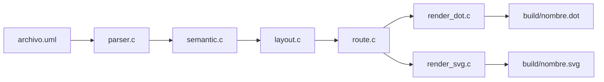

# Guía de Presentación — Mini PlantUML en C

Documento para explicar qué hace el proyecto, cómo está organizado el código y cómo resolvimos los problemas principales.

---

## Qué es (frase de apertura)

> **Mini PlantUML en C** es un intérprete que lee un archivo `.uml` con un lenguaje propio (DSL), lo analiza como un compilador (lexer → parser → semántica), calcula el layout del diagrama, optimiza las rutas de las flechas, y genera salida **DOT** y **SVG**.

---

## Raíz del proyecto

```txt
diagramador de clases/
├── include/uml.h          ← tipos y API compartida
├── src/                   ← implementación
│   ├── main.c             ← punto de entrada / CLI
│   ├── parser.c           ← lexer + parser
│   ├── semantic.c         ← validaciones
│   ├── layout.c           ← tamaño y posición de cajas
│   ├── route.c            ← optimizador de conectores
│   ├── render_dot.c       ← exporta DOT
│   ├── render_svg.c       ← exporta SVG
│   ├── render_raylib.c    ← ventana opcional (raylib)
│   └── util.c             ← errores y utilidades
├── examples/              ← diagramas de ejemplo
├── tests/                 ← casos con errores
├── build/                 ← binario y salidas generadas
├── Makefile
├── README.md
└── PRESENTACION.md        ← este archivo
```

---

## Flujo general

```txt
archivo.uml
    → parser.c       (lexer + parser)
    → semantic.c     (validaciones)
    → layout.c       (cajas UML)
    → route.c        (optimizador de flechas)
    → render_dot.c   (DOT intermedio)
    → render_svg.c   (SVG final)
```



**Punto clave:** si falla el análisis, el programa **no genera archivos** y muestra errores en la terminal con línea y columna.

El corazón del pipeline está en `src/main.c`:

```c
compute_layout(diagram, layout);
plan_routes(diagram, layout);

if (options.ascii) {
    render_ascii(diagram, layout);
}

if (options.dot_path != NULL) {
    render_dot(diagram, layout, options.dot_path, &errors);
}

if (options.svg_path != NULL) {
    render_svg(diagram, layout, options.svg_path, &errors);
}
```

---

## Módulos: qué decir en cada uno

### 1. `include/uml.h` — el modelo de datos

Aquí definimos todas las estructuras del diagrama: clases, atributos, métodos, posiciones, segmentos, relaciones y errores. Es el contrato entre todos los módulos.

Conceptos clave:

| Tipo | Qué representa |
|---|---|
| `Diagram` | Todo el diagrama (clases, posiciones, segmentos, relaciones) |
| `ClassDecl` | Una clase UML |
| `Layout` / `ClassBox` | Cajas ya dimensionadas para dibujar |
| `RelationDecl` | Flecha final con sus puntos de ruta |
| `ErrorList` | Lista de errores con línea, columna y mensaje |

---

### 2. `src/parser.c` — lexer y parser

Convierte texto `.uml` en estructuras C. Tiene un **lexer** (tokens) y un **parser recursivo descendente**.

Reconoce palabras como: `Diagrama`, `posicion`, `clase`, `segmento`, `herencia`, `composicion`, `agregacion`, `dependencia`, etc.

**Ejemplo de entrada** (`examples/cuatro.uml`):

```txt
Diagrama Cuatro.

posicion Fuente {
X=80;
Y=50;
}

posicion Recto {
X=80;
Y=280;
}

segmento (Recto, Fuente, herencia);
segmento (Pieza, Recto, composicion);
segmento (Puente, Pieza, agregacion);
segmento (Puente, Recto, dependencia);

abstracta clase Fuente {
atributos:
protegido int id;
metodos:
publico string describir();
}

clase Recto hereda Fuente { ... }
```

**Qué decir:** el usuario declara **dónde** van las clases (`posicion`) y **qué relaciones** hay (`segmento`), sin dibujar coordenadas de flechas a mano.

---

### 3. `src/semantic.c` — analizador semántico

Valida reglas que el parser no puede saber solo con sintaxis:

- Clases duplicadas
- Posiciones inválidas o repetidas
- Referencias a clases que no existen
- Atributos o métodos duplicados
- Conflictos entre atributos y métodos con el mismo nombre

También **arma la lista final de relaciones** uniendo:

- Relaciones declaradas en clases (`clase X hereda Y`)
- Segmentos del diagrama (`segmento (A, B, herencia)`)

**Ejemplo de validación:**

```c
if (diagram_find_position(diagram, klass->name) == NULL) {
    error_add(errors, klass->line, klass->column,
              "la clase '%s' no tiene posicion declarada", klass->name);
}
```

**Demo de errores:**

```bash
./build/uml_engine examples/invalido.uml
```

Salida típica:

```txt
Error 23:1: clase duplicada 'Cliente'
Error 8:1: dos clases no pueden ocupar la misma posicion (40,40)
Error 13:1: segmento referencia clase destino inexistente 'Producto'
Error 18:13: atributo duplicado 'id' en clase 'Cliente'
Error 20:1: metodo 'id' no puede llamarse igual que un atributo en 'Cliente'
```

**Qué decir:** si hay errores, el programa se detiene y **no crea** `build/*.dot` ni `build/*.svg`.

---

### 4. `src/layout.c` — diseño de cajas

Toma cada clase y calcula el tamaño de su caja UML (nombre, atributos, métodos) según el contenido. Usa las coordenadas `X,Y` del `.uml` como posición base.

Resultado: un `Layout` con `ClassBox` (`x`, `y`, `width`, `height`) listo para dibujar.

También incluye `render_ascii()` para mostrar una vista previa en texto en la terminal.

---

### 5. `src/route.c` — el optimizador de conectores

Este es el paso intermedio clave. **No mueve las clases**; solo calcula cómo deben ir las flechas para que el SVG se vea limpio.

Qué hace:

- Rutas ortogonales (ángulos recto)
- Columnas alineadas → línea vertical recta
- Misma fila → línea horizontal directa
- Destino abajo a la izquierda → corredor entre columnas
- Evalúa varias rutas candidatas y elige la **más corta**
- Evita que las líneas crucen cajas ajenas
- Separa canales horizontales para que las flechas no se pisen

Se ejecuta **en cada corrida exitosa**, justo antes de renderizar:

```c
compute_layout(diagram, layout);
plan_routes(diagram, layout);
```

**Ejemplo concreto en `cuatro.uml`:**

| Relación | Problema antes | Solución |
|---|---|---|
| `Puente → Recto` | U larga por abajo | Línea horizontal directa |
| `Puente → Pieza` | T en la columna central | Corredor interno (x ≈ 272) |
| `Recto → Fuente` | zig-zag | Vertical recta |
| `Pieza → Recto` | codos extra | Vertical recta |

---

### 6. `src/render_dot.c` — paso intermedio DOT

Exporta un archivo Graphviz con nodos UML y aristas con el tipo de flecha correcto. Guarda la ruta optimizada en el atributo `route`:

```c
fprintf(out, ", route=\"");
for (size_t p = 0; p < relation->point_count; p++) {
    fprintf(out, "%s%d,%d", p == 0 ? "" : " ",
            relation->points[p].x, relation->points[p].y);
}
fprintf(out, "\"");
```

Tipos de flecha UML:

| Relación | Estilo DOT |
|---|---|
| Herencia | `arrowhead=empty` (triángulo vacío) |
| Dependencia | `style=dashed`, `arrowhead=open` |
| Composición | `arrowhead=diamond` (rombo relleno) |
| Agregación | `arrowhead=odiamond` (rombo vacío) |

---

### 7. `src/render_svg.c` — salida final SVG

Pinta el diagrama final: cajas, texto, polylines y marcadores UML.

**No calcula rutas**; usa los puntos que ya dejó `plan_routes` a través de `compute_relation_points()`.

---

### 8. `src/main.c` — interfaz de línea de comandos

Orquesta todo el pipeline y maneja argumentos.

**Comando principal** (sin abrir navegador):

```bash
make
./build/uml_engine examples/cuatro.uml
```

Genera automáticamente:

- `build/cuatro.dot`
- `build/cuatro.svg`

Flags útiles:

| Flag | Qué hace |
|---|---|
| *(sin flags)* | Genera `build/<nombre>.dot` y `build/<nombre>.svg` |
| `--ascii` | Vista previa en terminal (texto) |
| `--open` | Abre el SVG en el navegador (opcional) |
| `--dot ruta` | Ruta personalizada para DOT |
| `--svg ruta` | Ruta personalizada para SVG |
| `--view` | Ventana raylib (requiere `make raylib`) |

---

## Ejemplos incluidos

| Archivo | Para qué mostrarlo |
|---|---|
| `examples/cuatro.uml` | 4 clases, 4 tipos de relación, optimizador |
| `examples/biblioteca.uml` | Diagrama más grande |
| `examples/juego.uml` | Ejemplo del PDF / enunciado |
| `examples/invalido.uml` | Errores semánticos variados |
| `tests/duplicados.uml` | Otro caso de errores (clase duplicada, posición repetida) |

---

## Cómo resolvimos los problemas

### 1. Conectores ilegibles

**Problema:** las flechas salían con codos raros, intersecciones en T y líneas cruzando cajas.

**Solución:** agregamos `plan_routes()` como paso entre layout y render. El optimizador calcula rutas ortogonales automáticamente.

### 2. Segmentos manuales innecesarios

**Problema:** había que escribir coordenadas a mano en cada segmento.

**Solución:** simplificamos el DSL. Basta declarar:

```txt
segmento (Recto, Fuente, herencia);
```

### 3. Pipeline claro

**Solución:** separación de responsabilidades en etapas bien definidas:

```txt
UML → parser → semántica → layout → plan_routes → DOT → SVG
```

### 4. Un solo comando

**Problema:** había que pasar `--dot` y `--svg` manualmente.

**Solución:** con solo el archivo `.uml`, el motor genera todo en `build/`:

```bash
./build/uml_engine examples/cuatro.uml
```

### 5. Errores claros

**Solución:** formato `Error linea:columna: mensaje`. Si el `.uml` es inválido, no se crean archivos de salida.

### 6. Sin abrir navegador por defecto

**Problema:** `--open` abría el SVG en el navegador automáticamente.

**Solución:** los targets de Make y el uso normal ya no incluyen `--open`. La salida queda en terminal.

---

## Comandos para la demo en vivo

```bash
# Compilar
make

# Diagrama válido → DOT + SVG
./build/uml_engine examples/cuatro.uml

# Vista previa en terminal
./build/uml_engine examples/cuatro.uml --ascii

# Mostrar errores
./build/uml_engine examples/invalido.uml

# Con Make
make diagram UML=examples/biblioteca.uml
make preview
make test
```

---

## Guión de cierre (30 segundos)

> Construimos un mini-compilador de diagramas UML en C. El usuario escribe clases y relaciones en un DSL simple. El sistema analiza, valida, calcula el layout, optimiza las flechas automáticamente, y produce DOT y SVG. Si el `.uml` tiene errores, los reporta con línea y columna sin generar salida. El optimizador es la pieza que hace que el diagrama final se vea profesional, sin que el usuario tenga que dibujar cada conector a mano.

---

## Sugerencia de diapositivas

| # | Título | Contenido |
|---|---|---|
| 1 | Problema | Dibujar diagramas UML a mano es lento y propenso a errores |
| 2 | Solución | Mini PlantUML: DSL + compilador en C |
| 3 | Arquitectura | Pipeline: parser → semántica → layout → rutas → render |
| 4 | DSL | Ejemplo `cuatro.uml`: posiciones, clases, segmentos |
| 5 | Semántica | Validaciones y reporte de errores |
| 6 | Optimizador | `route.c`: rutas ortogonales automáticas |
| 7 | Demo | Comando único + SVG generado |
| 8 | Cierre | Compilador completo, extensible, sin dependencias pesadas |
